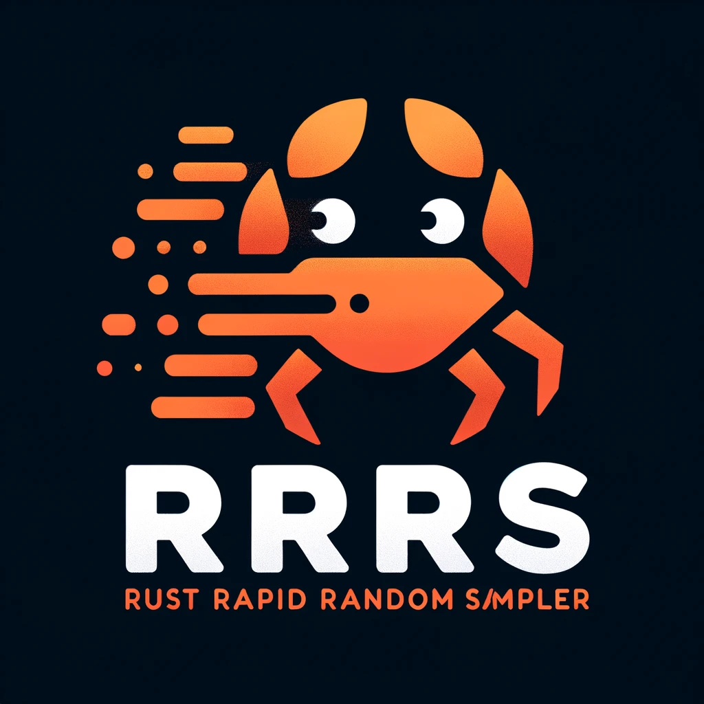

[//]: # (Image in `.assets/logos/logo.webp`)

<h1 align="center">
  
  <br>
</h1>

<div align="center">
  <a href="https://crates.io/crates/rrrs">
    
  </a>
</div>

RRRS: Rust(ic) Rapid Random Sampler
===================================

Welcome to RRRS, a rapid, hyper-optimized CSV random sampling tool designed with performance and efficiency at its core. Crafted meticulously in Rust, RRRS offers an unparalleled solution for extracting random data samples from CSV files swiftly and effortlessly.

🚀 Features
-----------

*   **Rapid Random Sampling**: Quickly extract random samples from large CSV files.
*   **Hyper-Optimized Performance**: Leveraging Rust's powerful system-level capabilities for maximum speed.
*   **User-Friendly**: Simple command-line interface to specify input and output with ease.
*   **Flexibility**: Customizable random sampling according to your data analysis needs.
*   **Cross-Platform Compatibility**: Runs seamlessly on any platform supporting Rust.

🛠 Usage
--------

To get started with RRRS, follow these simple steps:

`rrrs -i <input_file_path> -o <output_file_path>`

Upon execution, RRRS will prompt you to enter the desired number of rows to be randomly sampled from your CSV file. The output will be a new CSV file, named with the original file title plus a suffix indicating the number of sampled rows (e.g., `slogan_data-100`). This file will be saved either in the execution path or a specified output directory.

📂 Directory Structure
----------------------

Understand the organization of RRRS with the following directory structure:

```bash
rrrs/
├── Cargo.toml              # Project manifest
├── src/                    # Source files
│   ├── main.rs             # Entry point
│   ├── library.rs          # Library code
│   ├── args.rs             # Argument parsing
│   └── library/            # Library code
│       ├── sampler_ops/        # Sampling operations
│       │   ├── sampler_ops.rs      # Sampling logic
│       └── csv_ops/            # CSV operations
│           ├── csv_loader.rs   # CSV loading functionality
│           └── csv_writer.rs   # CSV writing functionality
└── tests/                  # Automated tests
    ├── args_tests.rs       # Tests for argument parsing
    ├── csv_loader_tests.rs # Tests for CSV loading
    ├── sampler_tests.rs    # Tests for sampling logic
    └── csv_writer_tests.rs # Tests for CSV writing
```

📚 Getting Started
------------------

### MacOS and Linux

To use RRRS, you need to have Rust installed on your machine. If you don't have Rust installed, install it using the following command: `curl --proto '=https' --tlsv1.2 -sSf https://sh.rustup.rs | sh`. *For more information, refer to the official Rust installation guide [here](https://www.rust-lang.org/tools/install).*

Once Rust is installed, you can install RRRS using the following command: `cargo install rrrs`.

### Windows

**Note**: RRRS is not yet supported on Windows. However, you can still use it by installing the Windows Subsystem for Linux.

### Building from Source

To build RRRS from source, you can clone the repository and build it using the following commands (*Note that this is primarily for development purposes*):

```bash
git clone --branch development git@github.com:ethan-wickstrom/rrrs.git
cd rrrs
cargo build --release
cp target/release/rrrs /usr/local/bin
```

🤝 Contributing
---------------

Contributions to RRRS are warmly welcomed. Feel free to open an issue or submit a pull request, whether it's bug reports, feature requests, or code contributions. Please refer to the contributing guidelines for more details.

**Please note to clone from the `development` branch when making code contributions!**

📝 License
----------

RRRS is open-sourced under the Apache-2.0 license. See the LICENSE file for more details.
